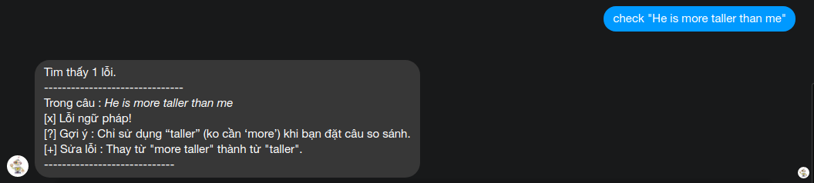

# A messager chatbot for checking english grammar.
### Technologies and libraries : Facebook Message API, LanguageTool Public API, python (Flask) for creating API.

### How to use Public API LanguageTool : http://wiki.languagetool.org/public-http-api
### Create a Facebook App, request Messager API permission and get its token : https://developers.facebook.com/apps/
### Deploy application and add link to API server to Facebook webhook url.

# Installatiion:

```sh
pip install -r requirements.txt
```

# Usage:
## From command line.
```sh
python grammerchecker.py
```

## From chatbot
Example in : m.me/sherlocklearning
type : check "{english-for-checking}"


